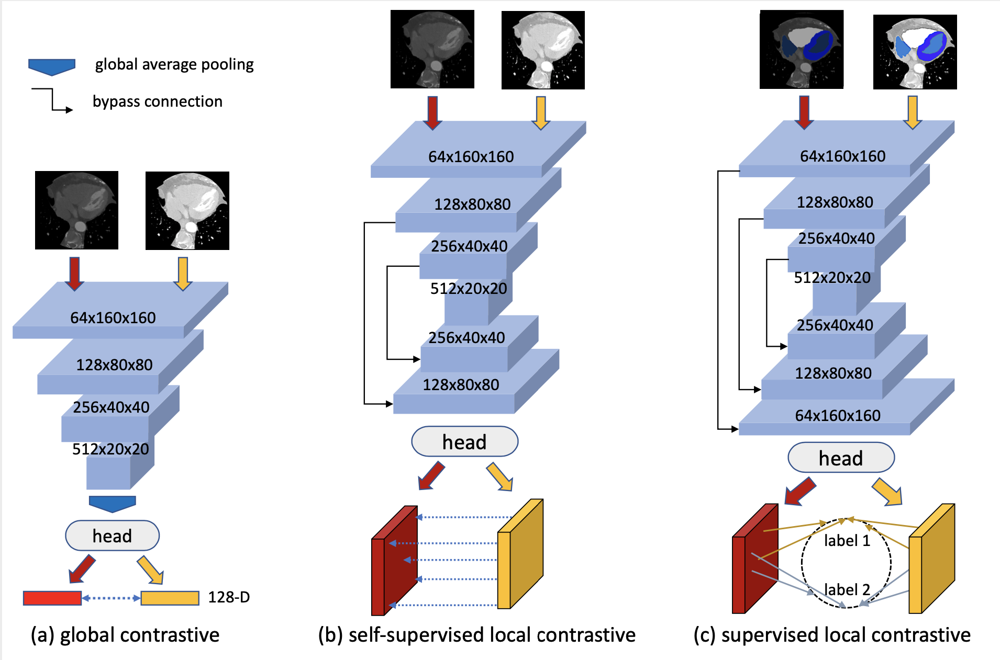

# Semi-supervised Contrastive Learning for Label-efficient Medical Image Segmentation
This is the pytorch implementation of paper "Semi-supervised Contrastive Learning for 
Label-efficient Medical Image Segmentation".


##Setup
###Environment
```
python=3.7.10
torch==1.8.1
torchvision=0.9.1
```
###Dataset
We will take the [Hippocampus dataset](https://drive.google.com/file/d/1RzPB1_bqzQhlWvU-YGvZzhx2omcDh38C/view?usp=sharing)
 as the example to illustrate how 
to do the preprocessing. Put the images .nii.gz files in ./data/Hippocampus/imgs folder and labels files in 
./data/Hippocampus/labels.
```
cd dataset/prepare_dataset
python preprcocessing.py
python create_splits.py
```
After which,the images and labels will be restored together in .npy file with shape normalized to target size.

##Run the codes
To run the global pretraining. Thie part is mainly based on the repository [PyTorch SimCLR: A Simple Framework for 
Contrastive Learning of Visual Representations](https://github.com/sthalles/SimCLR/blob/master/README.md)
```
bash run_simclr.sh
```
To run the supervised pixel-wise contrastive learning,
```
bash run_coseg.sh
```
To combine the above two pretraining, run run_simclr.sh first and the pretrained model will be saved at 
save/simclr/Hippocampus/ and set --pretrained_model_path  ${the saved model path} in run_coseg.sh.

As for the segmentation finetuning, remember to load the saved model, and
```
bash run_seg.sh
```

Notice that in all the above three files, there is a parameter named train_sample, which means the percentage of labeled 
data to use. 

If you use our codes or find our codes useful, please cite
```
@inproceedings{hu2021semi,
  title={Semi-supervised Contrastive Learning for Label-Efficient Medical Image Segmentation},
  author={Hu, Xinrong and Zeng, Dewen and Xu, Xiaowei and Shi, Yiyu},
  booktitle={International Conference on Medical Image Computing and Computer-Assisted Intervention},
  pages={481--490},
  year={2021},
  organization={Springer}
}
```
